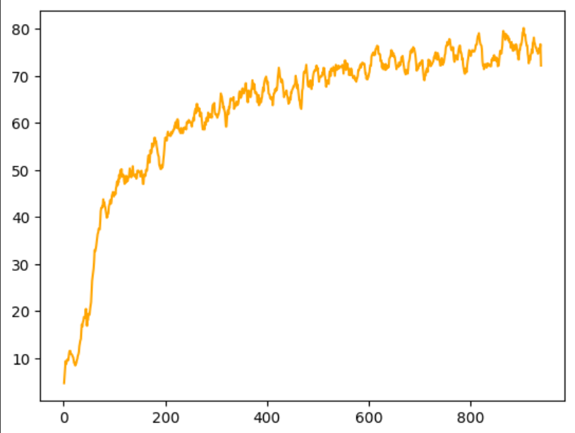
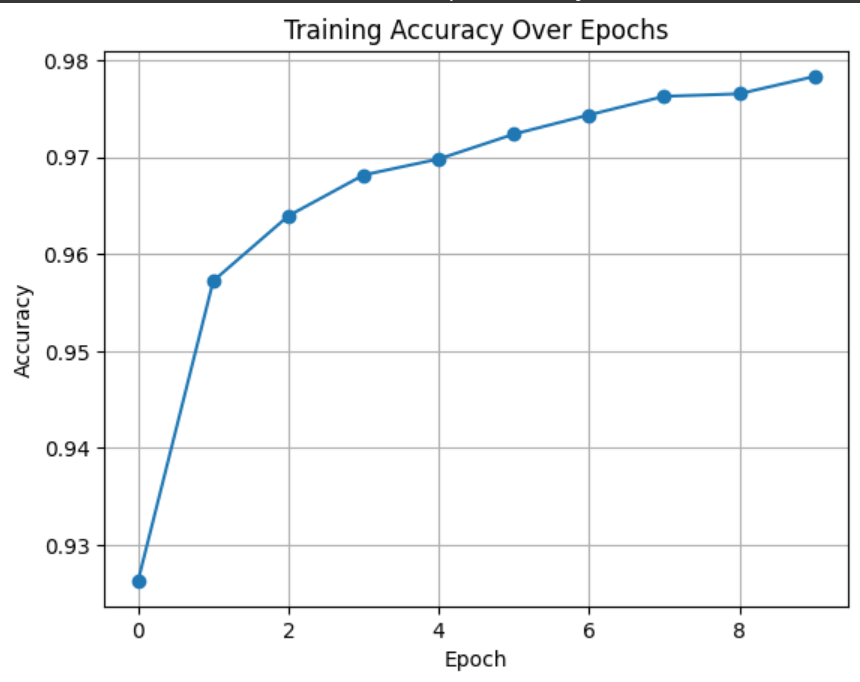
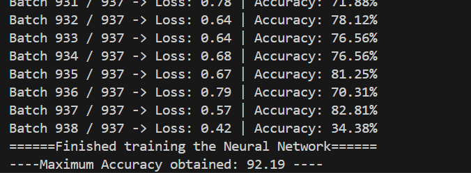

# 🧠 Neural Network From Scratch in C++

This project is a full implementation of a Feedforward Neural Network written entirely in **C++**, without using any machine learning libraries. It was built to understand the core mathematics and training logic behind neural networks — including forward propagation, backpropagation, activation functions, softmax, and weight updates.

---

## 🎯 Goal

To learn and implement the internal workings of a neural network from scratch by:
- Loading and preprocessing MNIST-style data
- Manually coding every part: forward pass, gradients, backpropagation
- Training the model with mini-batch gradient descent
- Evaluating accuracy and tuning hyperparameters

---

## 🚀 Features

- Loads and processes the **Fashion MNIST** dataset (same format as original MNIST)
- Implements:
  - Fully connected dense layers
  - ReLU and Softmax activations
  - Categorical Cross-Entropy Loss
  - Mini-batch training
  - Accuracy evaluation
- Manual learning rate tuning
- Tracks best accuracy during training
- Lightweight (STL only), no external libraries

---

## 🛠️ Getting Started

### 1. 🧾 Prerequisites

- C++ compiler (G++ recommended)
- CMake (optional for project organization)
- Fashion MNIST dataset (IDX format)

### 2. 📦 Folder Structure for Dataset

Place the dataset in the following structure:

```bash
data/
├── train-images.idx3-ubyte
├── train-labels.idx1-ubyte
├── t10k-images.idx3-ubyte
└── t10k-labels.idx1-ubyte
```

You can download the dataset from [here](https://github.com/zalandoresearch/fashion-mnist/tree/master/data/fashion).

### 3. ⚙️ Compile and Run

```bash
g++ -O2 main.cpp -o neural_net
./neural_net
```
## 📚 Architecture Overview

The neural network is composed of:

- **Input Layer**: 784 nodes (28×28 image)
- **Hidden Layers**: Tunable (e.g., 128 or 64 neurons)
- **Output Layer**: 10 nodes (Softmax for 10 classes)

### 🔧 Activation Functions
- **ReLU** in hidden layers
- **Softmax** in output layer

### 📉 Loss Function
- **Categorical Cross-Entropy**

---

## 🔁 Training Loop

1. **Forward Pass** – Calculate activations layer by layer  
2. **Loss Calculation** – Compute Softmax + Cross Entropy loss  
3. **Backpropagation** – Derive and apply gradients  
4. **Weight Update** – Update weights using SGD (with manually tuned learning rate)  
5. **Evaluation** – Track and log maximum accuracy on the test set

---

## 🧪 Hyperparameter Tuning

You can experiment with:
- **Learning rate** (`lr`)
- **Number of hidden layers**
- **Batch size**
- **Epoch count**

With the current setup, you can achieve around **85–90% accuracy** on the Fashion MNIST dataset. With further tuning or architectural improvements, the accuracy can go even higher.

---

## 🔄 Saving Model (Optional)

Use the provided `saveModel` and `loadModel` functions (work in progress) to:
- 💾 **Save** the best-performing weights and biases to a file
- 📂 **Load** them later for evaluation or inference


## 📈 Performance vs Frameworks

| Feature            | This Project (C++) | TensorFlow Model |
|-------------------|--------------------|------------------|
| **Accuracy**       | ~85–90%            | ~95–97%          |
| **Flexibility**    | Low                | High             |
| **Reusability**    | Low                | Very High        |

> This project prioritizes **learning over performance**. Unlike frameworks, everything is manually coded to **demystify the internals**.

---

## 🆚 Output Comparison (C++ vs TensorFlow)

To better appreciate this project’s learning value, here’s a comparison of the accuracy on the same Fashion MNIST dataset:





Even though the TensorFlow model performs better overall, the C++ model still produces reasonable predictions. The aim here is to **understand how each prediction is formed internally**, not just achieve the highest accuracy.

---

## 🖼️ Sample Output (Console Logs)

Below is a snapshot of the console during training:





## 💡 Notes & Reflections

This project started as a **personal challenge** — to build a neural network from scratch in just a week.

There were a lot of rough patches along the way — bugs in gradients, dimension mismatches, exploding values — all of which forced me to go back to the math, sketch things out in a notebook, and rebuild piece by piece.

After a lot of **messing around with learning rates** and tuning the batch size, I finally reached a working model that could consistently perform well on Fashion MNIST. This helped me truly understand how **backpropagation works**, and why frameworks do what they do under the hood.

---

## 📌 Future Improvements

- ✅ Modularize the code into `Layer`, `Model`, `Trainer` classes  
- ✅ Add more activation functions and optimizers  
- ✅ Configurable architecture via CLI or JSON  
- ✅ Add visualizations or plots  
- ✅ Better documentation and comments  

---

## 🙏 Credits

- Fashion MNIST Dataset from [Zalando Research](https://github.com/zalandoresearch/fashion-mnist/tree/master/data/fashion)  
- Inspired by educational efforts to deeply understand ML foundations

---

## 📬 Contact

If you have any suggestions or improvements, feel free to **raise an issue** or **fork the project**!
